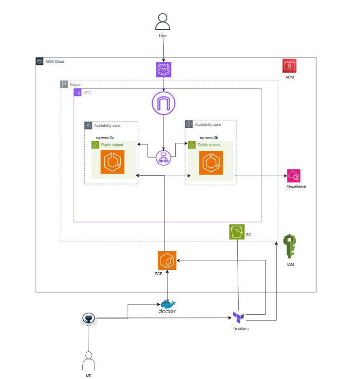
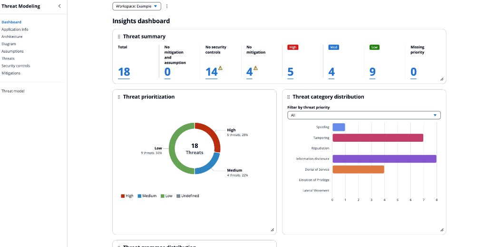
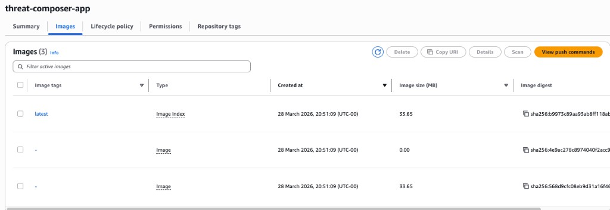
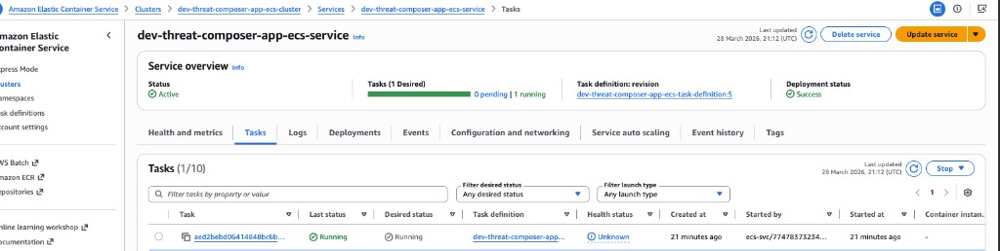

# Threat Composer — ECS Deployment

This project deploys [AWS Labs Threat Composer](https://awslabs.github.io/threat-composer/workspaces/default/dashboard), an open-source threat modeling web application, to **Amazon ECS (Fargate)**. The container image is stored in **ECR**, traffic is served over **HTTPS** via an **Application Load Balancer**, and DNS for **titotest.co.uk** is managed with **Route 53** and **ACM**.

Infrastructure is defined with **Terraform**, using a mix of **local modules** (VPC, ALB, ECR, ECS) and **reusable modules** from a separate Git repository. **Terraform state** is stored remotely in **Amazon S3** with **DynamoDB** locking (`terraform/backend.tf`).

**Committed defaults** (override in `terraform/terraform.tfvars` as needed): AWS region **`us-east-1`**, environment **`dev`**, project name **`threat-composer-app`**, public site **`https://www.titotest.co.uk`** (`record_name = "www"`, `domain_name = "titotest.co.uk"`). The ECR repository name matches **`project_name`** (`threat-composer-app`), consistent with `docker/build-push-image.sh`.

> **Roadmap:** Continuous integration and delivery (CI/CD) for build, test, and deploy will be added in a future update once implemented.

---

## Table of contents

- [Architecture](#architecture)
- [Running service](#running-service)
- [AWS console — ECR & ECS](#aws-console--ecr--ecs)
- [Project structure](#project-structure)
- [Prerequisites](#prerequisites)
- [Containerization (Docker)](#containerization-docker)
- [Terraform infrastructure](#terraform-infrastructure)
- [Deployment overview](#deployment-overview)
- [Useful links](#useful-links)

---

## Architecture

High-level flow: users resolve your domain via **Route 53**, connect to the **ALB** with TLS from **ACM**, and the ALB forwards traffic to **ECS Fargate** tasks that pull the image from **ECR**. Networking lives in a **VPC** across multiple Availability Zones.



*If your diagram was drawn for another region, compare it to `aws_region` in `terraform/terraform.tfvars` (currently **`us-east-1`**).*

---

## Running service

The application UI (example: Insights dashboard on an **Example** workspace) after deployment:



---

## AWS console — ECR & ECS

| Amazon ECR — `threat-composer-app` repository images | Amazon ECS — service tasks (e.g. `dev-threat-composer-app-ecs-service`) |
| :---: | :---: |
|  |  |

---

## Project structure

```text
Threat Composer App/
├── app/                          # Threat Composer frontend (Yarn / React build)
│   ├── package.json
│   ├── nginx.conf                # Copied into image for SPA + health checks
│   └── ...
├── docker/
│   ├── Dockerfile                # Multi-stage: Node build → nginx runtime
│   ├── build-push-image.sh       # Build, ECR login, tag, push
│   └── .dockerignore
├── images/                       # Screenshots for this README
├── terraform/
│   ├── main.tf                   # Root module wiring
│   ├── provider.tf               # Terraform & AWS provider constraints
│   ├── backend.tf                # Remote state: S3 + DynamoDB lock
│   ├── variables.tf
│   ├── outputs.tf
│   ├── terraform.tfvars          # Your values (region, domain, subnets, etc.)
│   └── modules/
│       ├── vpc/                  # VPC, public / private app subnets, security groups
│       ├── alb/                  # Application Load Balancer, listeners, target group
│       ├── ecr/                  # Container registry + repository policy
│       └── ecs/                  # ECS cluster, Fargate task/service, logs, IAM execution role
└── README.md
```

**External (reusable) modules** are referenced from `main.tf` via Git SSH, for example:

- `git::ssh://git@github.com/0byiaks/terraform-aws-modules.git//modules/acm`
- `git::ssh://git@github.com/0byiaks/terraform-aws-modules.git//modules/route53`

Local modules live under `terraform/modules/`.

---

## Prerequisites

- **AWS account** with permissions for VPC, ECS, ECR, ALB, IAM, ACM, Route 53, and CloudWatch Logs.
- **S3 and DynamoDB** access for the **remote state backend** (bucket and lock table named in `terraform/backend.tf` must exist and be reachable; Terraform needs `s3:GetObject`, `s3:PutObject`, etc., and DynamoDB conditional writes on the lock table).
- **AWS CLI** configured (`aws configure` or equivalent profiles).
- **Terraform** `>= 1.5.0` (see `terraform/provider.tf`).
- **Docker** (e.g. Docker Desktop or Colima) for local image builds.
- **SSH access to GitHub** for Terraform module sources that use `git::ssh://...` (or fork/vendor those modules and point `source` to your copy).
- **Registered domain** in Route 53 (this repo’s `terraform.tfvars` uses **titotest.co.uk** with **`www`** → **https://www.titotest.co.uk**).
- **Node / Yarn** only required if you develop or build the app outside Docker.

---

## Containerization (Docker)

The `docker/Dockerfile` uses a **multi-stage** build:

1. **Dependencies** — install packages from `package.json` / `yarn.lock`.
2. **Build** — copy application source from the build context and run `yarn build`.
3. **Runtime** — **nginx** serves the static `build` output; `app/nginx.conf` configures the SPA and health endpoint.

Build and push are automated in `docker/build-push-image.sh` (ECR login, tagging, and push). Run the script from the **repository root** so paths resolve correctly:

```bash
cd "/path/to/Threat Composer App"
./docker/build-push-image.sh
```

Equivalent manual build (from repo root):

```bash
docker build --platform linux/amd64 -f docker/Dockerfile -t threat-composer-app:latest app/
```

On Apple Silicon, `linux/amd64` builds can be slow (emulation); many teams build the release image in CI.

---

## Terraform infrastructure

Infrastructure is provisioned with **Terraform** (Infrastructure as Code) on AWS. Module sources are either **local** (`terraform/modules/…`) or **reusable modules** from another repository (`git::ssh://git@github.com/0byiaks/terraform-aws-modules.git//modules/…`).

**Remote state (`terraform/backend.tf`):**

| Setting | Value in this repository |
|--------|---------------------------|
| Backend type | `s3` |
| Bucket | `cloudporject-terraform-remote-state` |
| State key | `dev/threat-composer/terraform.tfstate` |
| Backend region | `us-east-1` |
| State locking | DynamoDB table `terraform-state-lock` |
| Encryption | `encrypt = true` |

The `terraform` block in `provider.tf` only pins **required_version** and **providers**; the **backend** lives in **`backend.tf`** (Terraform merges both files in the root module). Ensure the bucket and DynamoDB table exist before the first `terraform init` that uses this backend (or create them with a one-off bootstrap stack).

### VPC module (local)

- Creates the **VPC** with DNS hostnames and support enabled.
- **Public subnets** in two Availability Zones, attached to a **public route table** with an **Internet Gateway** for inbound/outbound internet traffic.
- **Private application subnets** for ECS tasks, with a **NAT Gateway** (and Elastic IP) so tasks can reach the internet (for example ECR image pulls) without public IPs.
- **Route tables** and subnet associations tie routing to public vs private subnets.

### ALB module (local)

- **Application Load Balancer** in the public subnets, internet-facing.
- **HTTP (port 80) listener** performs a **301 redirect to HTTPS** so clients always use TLS.
- **HTTPS (port 443) listener** uses the **ACM** certificate and **forwards** traffic to the target group.
- **Target group** uses **IP** targets (Fargate), **HTTP on port 80** to match the **nginx** container port, with **health checks** on `/` (HTTP, port 80).

### ECS module (local)

- **ECS cluster** running **AWS Fargate** (no EC2 capacity to manage).
- **Task definition** pulls the container image from **ECR** (`image` built from `ecr_repository_url` and `image_tag`).
- **ECS service** registers tasks with the **ALB target group** and runs in the **private app subnets**.
- **CloudWatch Logs** log group for container logs; **IAM** task execution role allows ECS to pull from ECR and write logs (plus attachment of **AmazonECSTaskExecutionRolePolicy**).

### ECR module (local)

- **Private ECR repository** for the Threat Composer image.
- **Repository policy** so the execution role / ECS can pull layers (GetDownloadUrlForLayer, BatchGetImage, BatchCheckLayerAvailability).

### Route 53 module (external)

- Uses the **hosted zone** you supply (`zone_id` in `terraform.tfvars`).
- Creates a **DNS record** for your hostname (for this project: **`www.titotest.co.uk`** under domain **titotest.co.uk** — driven by `record_name` and `domain_name`) as an **alias (A record)** pointing to the **ALB**, so traffic resolves to the load balancer.

### Security groups (within VPC module)

- **ALB security group:** allows inbound **HTTP (80)** and **HTTPS (443)** from the internet; egress as required for forwarding and health checks.
- **Application (ECS) security group:** allows inbound **HTTP on port 80 only from the ALB security group**, so tasks are not exposed directly from the internet. Egress is open for outbound dependencies (ECR, CloudWatch, etc.).

This keeps the path **User → ALB → ECS (nginx on 80)** tight and predictable.

### ACM module (external)

- Requests or references a **TLS certificate** for your domain (aligned with `domain_name` in Terraform variables).
- Certificate ARN is passed into the **ALB** module for the **HTTPS listener**, enabling **https://** for your public hostname.

### IAM (embedded in modules)

There is no separate root-level IAM module: **ECS** defines the **task execution role** and attachments; **ECR** holds the **repository policy** for pulls. Adjust or extend if you add task roles, CI/CD roles, or stricter least-privilege policies.

---

## Deployment overview

1. **Configure** `terraform/terraform.tfvars` (`aws_region`, CIDRs, `domain_name`, Route 53 `zone_id`, `record_name`, `image_tag`, etc.). Keep **`project_name`** aligned with the ECR repo name and `docker/build-push-image.sh` (`threat-composer-app` unless you change all three consistently).
2. **Ensure remote state** — S3 bucket and DynamoDB lock table from `backend.tf` exist and your credentials can access them.
3. **Build and push** the container image to ECR (`./docker/build-push-image.sh` uses **`us-east-1`** and repo **`threat-composer-app`**; match `aws_region` and `project_name` in Terraform or update the script).
4. **Initialize and apply** Terraform from `terraform/`:

   ```bash
   cd terraform
   terraform init    # configures the S3 backend; use -migrate-state if moving from local state
   terraform plan
   terraform apply
   ```

5. **Verify** DNS propagation, **HTTPS** at your record (e.g. **https://www.titotest.co.uk**), and ECS service **running** task count in the AWS console.

**Outputs:** Root `outputs.tf` currently exposes **`acm_certificate_arn`** (extend if you want ALB DNS, ECR URL, etc.).

After CI/CD is added, image build/push and optional Terraform steps can run from GitHub Actions (or another pipeline) instead of only from your laptop.

---

## Useful links

- [Threat Composer (AWS Labs)](https://awslabs.github.io/threat-composer/workspaces/default/dashboard)
- [Terraform AWS provider](https://registry.terraform.io/providers/hashicorp/aws/latest/docs)
- [Amazon ECS](https://docs.aws.amazon.com/ecs/latest/userguide/what-is-ecs.html)
- [Amazon ECR](https://docs.aws.amazon.com/ecr/latest/userguide/what-is-ecr.html)
